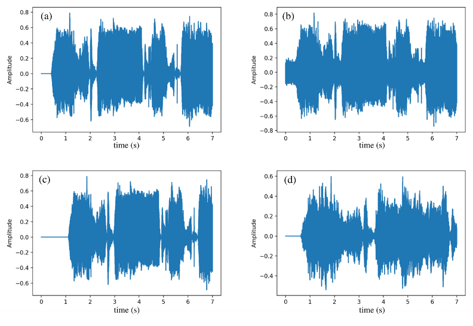
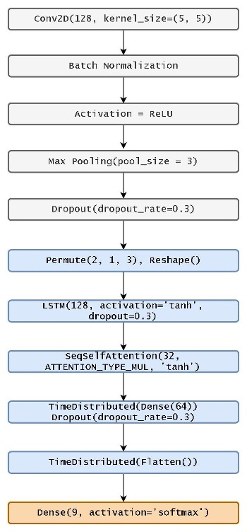

## BabyCry

Baby cry is the primary way that an infant communicates with the caregivers. 
There are several researches that convey the idea that babies produce different sounds to convey their emotions.
However, the task of recognizing these different cries and response accordingly is overwhelming for first-time parents. 
Thus, remote monitor is one common application of automatic infant cry recognition system. 

> Classify the baby cry sound into 8 different categories (hungry, needs burping, scared, belly pain, discomfort, cold/hot, lonely, tired).

To address this we explored a number of deep learning approaches such as Convolutional neural networks (CNN), 
Recurrent Neural Networks (RNN) and Attention Model to achieve th`e best result.

## Data Source

**Dataset** The primary data source for our project is <a href="https://github.com/gveres/donateacry-corpus#donateacry-corpus">donateacry-corpus</a>.
* audio files contain baby cry samples of infants from 0 to 2 years old.
* corresponding tagging information (the suspected reasons of cry) encoded in the filenames.
* Converted all files to WAV file format so that it could be easily read and interconverted by Python audio libraries (librosa, Wave and SoundFile).

**Data Cleaning** The following steps have been followed to extract useful data from the source repository
* Remove samples where cry was not dominant sound or audible.
* **Class Imbalance** problem, more than half the samples were tagged for hunger, was dealt with by **data augmentation**, **under sampling** and changing the **performance metrics**.

|Tags|Classes/Reason for Cry|Original Audio Count|Counts after cleaning|Audio used after including augmented data|
|:----|:----|:----|:----|:----|
|hu|Hungry|485|350|50|
|bu|Needs to burp|8|4|21|
|bp|Belly pain|10|7|24|
|dc|Discomfort|20|13|42|
|ti|Tired|19|15|56|
|lo|Lonely|17|12|44|
|ch|Cold/hot|10|8|28|
|sc|Scared|13|6|20|
|dk|Don’t know|134|86|58|

**Data Augmentation**
Our objective was to balance all the 9 classes, by creating new synthetic training samples by adding small perturbations on our initial training set, so that the model is not biased towards any one single class thus enhance its ability to generalize. 

The methods used for this process are:
* **Adding white noise:** Added noise with a maximum signal to noise ratio of 0.05 to each channel and generated new samples (see Fig 1.b).
* **Shifting the sound:** Additional audios were generated by shifting the original audio up to 20% of audio’s length. (see Fig 1.c).
* **Stretching the sound:** Generated more audios by speeding up the original audios while keeping the pitch unchanged (see Fig 1.d).

## Model
The model described below has given us the **highest accuracy and F1 score** out of all the experiments that we have performed. The model training consists of two phases. 
* phase 1: we extract the log Mel-band (MFCC) features.
* phase 2: train a deep learning model which consist of convolution, batch norm, pooling, LSTM-RNN, time distributed and attention layers.

**Extract log Mel-band (MFCC) features:** Sound frequencies in real life do not always occur in isolation but tend to considerably overlap with each other. These overlapping sounds can potentially be recognized better with multichannel audio detection techniques. Our input audio consists of two channels.  
Below are the various steps involved in extracting the multichannel Spectro-temporal features (spectrogram) from the raw wav audio file and input preprocessing:

* Split the file into fixed sized frames of equal lengths and extract the magnitude spectrum of the audio signals by using short-time Fourier transform (STFT) over 40 ms audio frames of 50% overlap, windowed with Hamming window.
* Extracted the log Mel-band energy features for each file using librosa library.
* Extracted feature shapes varies from (280, 80) to (381, 80) for different files.
* Apply padding 0 such that final feature matrix for each input file is of size (381, 80). Where 381 is the total number of sampled audio frames in the file including padding and each frame consists 80 MFCC features corresponding to two audio channels (40 MFCC features per channel). 
* Normalize the extracted features for each audio file and saved in compressed npz format using NumPy library.

**Deep Learning Model:**

Processing the baby cry is basically a type of pattern recognition. The feature that are invariant to temporal shifts can be learned by **CNN**. On the other hand, **RNN** are effective models to extract the longer-term temporal features in the audio signals. Therefore, we combined the two techniques in our final solution, we also added **attention layer** to our network so that only the important frames are selected while the unrelated frames are ignored which allowed us to suppress the background noise, thereby making the system more robust and accurate <a id="2">[2]</a>.

The extracted feature matrix is fed to this network and trained for 100 epochs which categorizes each of the 381 frames in a file to a class label. The class label predicted for maximum number of frames is the predicted label for the input audio file. The objective of the model is to classify each frame for the file to its correct class based on the input features for the current frame as well the previous frames (RNN cell state). 

The details of the network layers are as follows:

<table cellspacing="0" cellpadding="0">
  <tr>
    <td>
      &ensp;&ensp;Reshape the (381, 80) input shape to (2, 381, 40) representing (# of audio channels, # for audio frames in the file, Mel-band features). Each audio frame can be thought analogues to image frames in a video file and each channel can be thought of analogues to different color channels in an image.  
      &ensp;&ensp;2-dimensional Convolutional layer (128 filters) with <b>Rectified Linear Unit (ReLU)</b> as activation unit. Kernel size is (5X5). This layer extracts high dimensional, local frequency shift invariant features.  
      &ensp;&ensp;For regularization to avoid overfitting, we used <b>batch normalization</b>, a <b>pooling layer</b> with filter size 3 and a <b>30% dropout</b> following the 2D Convolutional layer.  
      &ensp;&ensp;A permute and reshape layer is being used to reshape the input to be suitable for next LSTM-RNN layer. Input is changed from (# of filters, # of audio frames, # of high-level CNN features) to (# of audio frames, # of high-level CNN features).  
      &ensp;&ensp;A 128-unit LSTM-RNN layer with <b>tanh activation</b> is being used to captures longer temporal dependencies between the audio frames.  
      &ensp;&ensp;An <b>attention layer</b> is added after the LSTM layer with a tanh Activation Function, Attention Type as Multiplicative and an Attention Width of 32 which learns weights for frames such that the important frames with baby cries will have higher weight values thus increasing the accuracy of the network.  
      &ensp;&ensp;2 Time-Distributed layers added which are wrappers that applies a standard dense neural network to every temporal slice of an input i.e. each timestep independently, thus enhancing the strength of RNN.  
      &ensp;&ensp;<b>SoftMax activation</b> is used in final layer to predict the probability of each of the 9-possible outcome. Final output is of shape (381, 9). Each of the audio frame in the input file is assigned a 9-Dimensional probability vector. The majority class across all the frames would be final predicted label for the whole input file.  
      &ensp;&ensp;The network is trained with back-propagation through time using <b>Adam optimizer</b> and <b>categorical cross-entropy</b> as the loss function.  
    </td>
    <td>
      
    </td>
  </tr>
</table>

## Result

The **first model** that we developed comprised of 3 layers of CNN followed by 3 layers of RNN and max pooling with a single dense layer as the ultimate layer having sigmoid activation. It was a replica of the model suggested by Adavanne et. al. <a id="3">[3]</a>. However, the accuracy was too low, around 50%. So, taking inspiration from the CRNN architecture used in audio recognition systems and with the knowledge of methods taught in class we proceeded with the second model.

Our **second model** was a single layer CNN network followed by 1 layer of LSTM with time distributed dense layers (model depicted above excluding the attention part). We also experimented with the GRU and Bidirectional GRU as GRU has proven in the past to behave better on speech recognition problems. The accuracy in all these experiments exceeded 60% which was quite better than the first model.

Finally, we then added **Attention layer** on top of our second model which **gave the maximum boost in F1 score**. As per our analysis both **LSTM and GRU result in similar validation F1 score**, thus we went with LSTM along with Attention Models for our final model which resulted in validation F1 score of 0.75. The table below depicts some of the experiments with significant results.

|Model|Accuracy|F1|
|:----|:----|:----|
|1 Layer CRNN with time dist. Layers (Model 2)|73%|.72|
|Model 2 with Attention Layer (Attention sequence type = Additive, Attention width =16)|70%|.71|
|Model 2 with Attention Layer (Attention sequence type = Multiplicative, Attention width =32)|76%|.75|
|Bidirectional GRU with Attention Layer|70%|.71|
|Bidirectional GRU without Attention Layer|69%|.68|
|GRU with Attention Layer|69%|.69|
|GRU without Attention Layer|62%|.62|

## References

<a id="1">[1]</a>  aqibsaeed/Urban-Sound-Classification, https://github.com/aqibsaeed/Urban-Sound-Classification, 2016 
<a id="2">[2]</a>  Yong Xu, Qiuqiang Kong, Qiang Huang, Wenwu Wang, & Mark D. Plumbley (2017) Attention and Localization based on a Deep Convolutional Recurrent Model for Weakly Supervised Audio Tagging. arXiv:1703.06052v1 
<a id="3">[3]</a>  Sharath Adavanne, Pasi Pertilä & Tuomas Virtanen (2017) Sound Event Detection Using Spatial Features and Convolutional Recurrent Neural Network. arXiv:1706.02291v1 

